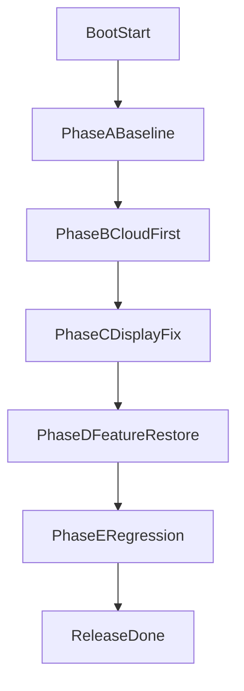

# PETOI_ESP32C3_CUBE 实施计划（平衡策略）

## 目标定义

在 `ESP32-C3`（无 PSRAM）约束下，将项目从“可被扫描但配网失败/白屏/提示音缺失”收敛到：

- BLE 配网一次成功率高（可稳定拿到 token 并完成激活）
- WiFi 关联 + TLS 建链成功（不再出现 `mbedtls_ssl_setup Fail 0xffff8100`）
- UI 非白屏，至少稳定显示基础状态文本
- 配网提示音在可用内存条件下可播报（或有明确降级策略）

## 已定位的主风险（来自现有日志）

- 内存水位过低：运行中出现 `free=280 / min_ever=12 / largest_block=192`，已低到影响 TLS、WiFi 与 UI。
- 云侧失败关键点：WiFi 已连上并拿到 IP 后，TLS 初始化失败（`mbedtls_ssl_setup Fail 0xffff8100`），高度符合内存不足/碎片导致的大块申请失败。
- 功能并发过重：`app_chat_bot_init()` 后同时拉起 UI + 音频链路 + AI 线程，Phase-4 后内存骤降。
- 板级外设有冲突信号：`GPIO 12/13 is not usable`，需要确认与 I2S/LCD 引脚复用风险。

## 关键代码位点

- 启动分阶段与配网入口：[tuya_main.c](/home/jasonw/Projects/TyOpen_Jason/TuyaOpen/apps/tuya.ai/petoi_esp32c3_cube/src/tuya_main.c)
- AI 初始化与 UI/音频并发入口：[app_chat_bot.c](/home/jasonw/Projects/TyOpen_Jason/TuyaOpen/apps/tuya.ai/petoi_esp32c3_cube/src/app_chat_bot.c)
- 应用内存预算配置：[app_default.config](/home/jasonw/Projects/TyOpen_Jason/TuyaOpen/apps/tuya.ai/petoi_esp32c3_cube/app_default.config)
- 板级引脚与显示缓冲配置：[board_config.h](/home/jasonw/Projects/TyOpen_Jason/TuyaOpen/boards/ESP32/PETOI_ESP32C3_CUBE/board_config.h)
- 板级硬件注册与背光控制：[petoi_esp32c3_cube.c](/home/jasonw/Projects/TyOpen_Jason/TuyaOpen/boards/ESP32/PETOI_ESP32C3_CUBE/petoi_esp32c3_cube.c)
- 历史问题收敛记录（可对照）：[issue_runtime_petoi_esp32c3_daily_summary_2026-03-20.md](/home/jasonw/Projects/TyOpen_Jason/TuyaOpen/docs/issue_runtime_petoi_esp32c3_daily_summary_2026-03-20.md)

## 实施阶段

### 阶段 A：建立“可验证基线”与故障门槛（1 天）

- 统一构建与日志采集流程，固定以下观测点：
  - Phase-1/2/3/4 heap、`largest_block`
  - `TUYA_EVENT_BIND_START` 到 `TUYA_EVENT_MQTT_CONNECTED` 全链路时间
  - TLS 失败码与重试间隔
- 增加“最低生存门槛”判定（不改行为，仅记录）：
  - `largest_block < 4KB` 标记高风险
  - `free_heap < 8KB` 标记临界风险
- 输出一份基线报告（便于后续每次改动做 A/B 对比）。

### 阶段 B：先打通配网与连云主链路（2-3 天）

- 目标是“先连上云”，暂时降低非关键并发：
  - 在 `app_chat_bot_init()` 中做分层启用开关：先保留最小 UI，推迟或关闭重内存模块（视频/图片/MCP/部分音频增强）。
  - 在 `tuya_main.c` 中将 AI 重模块初始化从 `tuya_iot_start()` 前后分离，避免和激活期 TLS 峰值叠加。
- 调整与校准内存参数：
  - 复核 `app_default.config` 中 ringbuf / stack / WiFi-BLE pool 的真实生效情况。
  - 确保只有单一配置源生效，避免 `sdkconfig` 残留覆盖。
- 验收标准：
  - BLE 下发 SSID/Token 后，设备 3 次连续可完成激活并进 `MQTT_CONNECTED`。
  - 不再出现 `mbedtls_ssl_setup Fail 0xffff8100`。

### 阶段 C：修复白屏并稳定最小可用 UI（1-2 天）

- 白屏优先从“背光/刷新链路/首帧触发”三点收敛：
  - 校验背光极性与 GPIO 生效时序（`board_display_init`）。
  - 校验 ST7789 尺寸、偏移、buffer 配置是否与实际屏幕一致。
  - 强制首帧可见内容（文字/图标 fallback）并记录首帧耗时。
- 排查音频 I2S 与显示引脚冲突（12/13 不可用告警）：
  - 若冲突成立，优先调整 I2S 引脚到板级可用口。
- 验收标准：
  - 上电后 5 秒内稳定显示初始化状态文本，连续 10 次启动无白屏。

### 阶段 D：恢复提示音与 AI 能力（2-4 天）

- 在“已稳定连云 + 可见 UI”基础上，逐项恢复能力：
  - 先恢复绑定提示音，再恢复 AI 聊天全链路（录音、播放、模式线程）。
  - 每恢复一个模块都记录 heap/fragmentation 变化，超过阈值立即回退该模块参数。
- 对低内存场景保留分级降级策略：
  - 高内存：提示音 + UI + AI 全开
  - 中内存：提示音降采样/缩短，保留核心交互
  - 低内存：跳过提示音，保证配网与云连接优先
- 验收标准：
  - 配网成功后可进入聊天待机，提示音可按策略触发；30 分钟运行不重启。

### 阶段 E：回归与发布封板（1-2 天）

- 执行回归矩阵：
  - 首次配网、断电重启重连、路由切换、弱网、反复 BLE 配网
  - 长稳测试（>=2h）与内存趋势
- 固化文档：
  - 最终配置、关键阈值、已知限制与恢复策略写入 docs。
- 发布标准：
  - 关键路径通过率 >=95%，无崩溃重启、无白屏、可稳定上云。

## 实施流程图

## 里程碑与交付物

- M1（阶段 A 结束）：基线日志与瓶颈证据清单
- M2（阶段 B 结束）：配网+激活+MQTT 连通演示日志
- M3（阶段 C 结束）：白屏修复视频/日志与屏幕配置定版
- M4（阶段 D 结束）：提示音与 AI 恢复策略说明
- M5（阶段 E 结束）：回归报告与最终发布配置

## 风险与回退策略

- 风险：C3 内存上限导致“功能越多越不稳定”。
- 回退原则：优先保证 `配网 > 上云 > 基础UI > 提示音 > 高级AI`。
- 工程策略：所有功能恢复都通过配置开关控制，保持可快速回退。